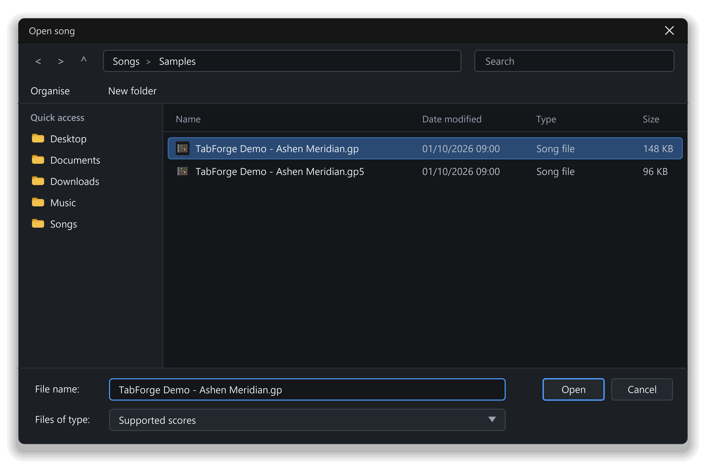

# Opening and playing a song

The quickest way to learn TabForge is to open a real song and listen to it. In this chapter you open the demo song, press play, jump to any bar and watch the notes move on screen as you hear them.

You also learn how to listen to one instrument alone, and how to keep several songs open side by side.

## What you will learn

- Open a song in the current tab or in a new document tab.
- Play, pause, stop, rewind and move by section.
- Start playing from any bar.
- Follow the playback line, the fretboard and the scrolling score.
- Mute or solo a track to hear one instrument.
- Keep several songs open at once.

## What can I open?

TabForge opens its own `.tforge` songs and the common tab-file types. This table lists every type it opens.

| Extension | What it is |
|---|---|
| `.tforge` | TabForge's own song file |
| `.gp` | The newer common tab-file format |
| `.gpx` | An older tab-file format |
| `.gp5` | An older tab-file format |
| `.gp4` | An older tab-file format |
| `.gp3` | An older tab-file format |

TabForge does not open MIDI files, MusicXML files, PDF files, text tab, or the oldest tab-file types `.gtp` and `.tg`. It can write some of these as exports, which **Chapter 12: Saving, sharing and exporting** covers.

The demo song is `TabForge Demo - Ashen Meridian.gp`. It lives in the `Samples` folder beside `TabForge.exe` and has ten tracks and 144 bars.

## Open a song

To open a song, use **File > Open…** (`Ctrl+O`). By default it opens the song in the current document tab. If that tab has unsaved changes, TabForge asks about them first. To keep the current song and open another beside it, choose **File > Open in new tab…** (`Ctrl+Shift+O`). That one always makes a new tab.

The Open window lists your folders and your song files. Select a file and click **Open**. You can select several files at once, by holding `Ctrl` or `Shift` while you click. The first one replaces the current tab when you used **Open…**, and the rest open in new tabs, in the order you picked them.

*Figure: choosing a song in the Open window.*

A big song takes a moment. While it loads, the status bar shows "Importing…" and a **Cancel** button. Click **Cancel** to stop the import, and no half-opened tab is left behind.

You can also drag a song file from Windows Explorer onto the TabForge window. It opens in a new tab, and several files dropped together each get a tab.

If TabForge is already running, double-clicking a song in Windows Explorer opens it as a new tab in that window. This works once TabForge is the program Windows uses for your song files, which the installer offers to set up.

> **Note:** An opened `.gp`, `.gp5` or other tab file is an unsaved copy with no file name. **Save** asks you for a name, so your original file is never changed unless you type its own name in **Save As**. A `.tforge` song is different: it remembers its file, so **Save** writes straight back to it.

## Play, pause and stop

Press `Space` to play. The song starts at the edit cursor, the highlighted beat in the score. Press `Space` again to pause, and once more to carry on from the same spot. `Shift+Space` always starts from the very beginning.

The transport buttons are at the left of the timeline's header. **Play / pause** is the main one. It shows a pause icon while the song plays.

- **Stop** (`Ctrl+Full stop`) stops the song and moves the playback line back to the edit cursor.
- **Rewind to beginning** moves to bar 1. If the song is playing, it restarts from there.
- **Next section** jumps to the first bar of the next section.
- `Esc` clears a selection first. Press it again to stop.

> **Tip:** Hover any transport button to read its name and its current key in brackets, for example "Play / pause (Space)".

Before you press play for the first time, mind the volume.

> **Warning:** Ashen Meridian is lively and loud. Turn your computer's volume down before the very first play, then raise it to suit.

### Try it: Play Ashen Meridian

*Goal: open the demo song, hear it and watch it move.*

1. Choose **File > Open…** (`Ctrl+O`). The Open window appears.
2. Go to the `Samples` folder beside `TabForge.exe`.
3. Choose `TabForge Demo - Ashen Meridian.gp`, then click **Open**. The song opens, and its title appears on the document tab.
4. Press `Space`. The song starts, and a line moves across the score.
5. Press `Space` again. The music pauses and the line stops.

You know it worked when you heard the music and the **Play / pause** button changed its icon while the song played.

## Start from any bar

You rarely want to hear a long song from the top. There are three quick ways to pick the spot.

- **Click a bar** in the score or on the timeline. The edit cursor moves there. While the song plays, a click moves playback there. Hover a bar on the timeline and it is shaded, to show which bar a click will pick.
- **Go to a bar by number or name.** Press `Ctrl+G`, type a bar number such as `40` or part of a section name such as `solo`, and press `Enter`. The cursor jumps there.
- **Use the Sections panel.** Click a section's name in the list, and the cursor jumps to that section's first bar. Press `Alt+Shift+Left` or `Alt+Shift+Right` to step to the previous or next section.

### Try it: Jump to the chorus

*Goal: start playing at Chorus 1, the main practice target in the demo song.*

1. Press `Ctrl+G`. A small prompt titled **Go to** opens.
2. Type `40`, then press `Enter`. The edit cursor jumps to bar 40, where **Chorus 1** begins.
3. Press `Space`. The chorus plays from its first bar.
4. Press `Space` to pause.
5. Press `Ctrl+G` again, type `solo` and press `Enter`. The cursor jumps to the **Solo** section at bar 102.

You know it worked when the chorus played from its first bar and the cursor then jumped to the solo. If a few letters match several section names, the first match wins, so type enough letters to be specific.

## Follow along

While a song plays, four things move at once. They always agree, so you can watch whichever suits you.

- **The playback line** crosses the score, and the score scrolls to keep it in view.
- **The fretboard** lights up the notes of the selected track. Its legend, at the bottom right, explains the dots: **now** for the sounding note, **next**, **upcoming** and **recent**.
- **The timeline** shows a playback position marker. By default it is a line. In **Preferences > Timeline & Tracks**, open **More options** in the **Timeline display** group and change **Playback position marker** to **Line**, **Bar marker** or **Both**.
- **The playing bar** can be highlighted. Choose **View > Highlight playing bar** to switch it on; it is off by default and the command has no default key. In **Preferences > Playback & Practice**, the **Appearance** group sets the colour and opacity, and **More options** adds a choice to show the cursor's bar when the song is stopped.
- **The status bar** shows the playing position: the bar, the track and the cell.

You choose how the score follows. Press `F12`, open **Playback & Practice** and find **Scroll the score while playing**. **Off** keeps the score still. **Jump** moves a line at a time. **Smooth** scrolls steadily, and it is the default.

If you scroll the score by hand while it plays, following pauses so that you can look around. It starts again the next time you press play.

## Hear one track at a time

A busy song is hard to learn from. Muting and soloing let you listen to one instrument. Each track has two buttons on its row in the track list. **Mute track**, the speaker icon, silences that track. **Solo track**, marked **S**, silences every other track so that you hear only this one.

Volume and pan are a separate topic, covered in **Chapter 9: Shaping the sound**.

### Try it: Hear the clean guitar alone

*Goal: solo one track in the intro and play it.*

1. With Ashen Meridian open, click the **Clean Gtr** row in the track list. The track is selected, and the fretboard shows its neck.
2. Click the **S** button on that row. The button lights, and the other tracks dim.
3. Press `Ctrl+G`, type `2` and press `Enter`. The cursor jumps to bar 2, inside the quiet intro.
4. Press `Space`. You hear only the clean guitar, playing through bars 2 to 9.
5. Press `Space` to pause, then click **S** again. All the tracks sound again.

You know it worked when the intro played with only the clean guitar, and the full song returned after step 5.

## Keep several songs open

Each open song has its own document tab, so you can keep a song you are learning beside one you are writing. Each tab can keep playing while you work in another. A small badge on a tab shows that its song is playing.

To choose what happens to the first song when you switch, open **Preferences > Playback & Practice** and look under **Several tabs**. You can let it continue (the default), pause it or stop it. To work on two songs in two windows, drag a tab out of the title bar, or right-click it and choose **Move to new window**. Drag the tab back to merge it again. If a window holds only one tab, dragging that tab moves the whole window, and dropping it on the tab bar of another window merges the song into that window.

## Speed and tempo at a glance

Two different numbers set how fast a song plays. The **BPM** box in the toolbar is the song's written tempo, in beats per minute. The **Speed** box in the top toolbar slows or speeds up playback without changing the song. Ashen Meridian is written at 150 BPM, which is fast for a beginner. **Chapter 3: Practice tools** shows how to slow it down.

## Quick recap

- **File > Open…** (`Ctrl+O`) opens a song in the current tab, and **Open in new tab…** (`Ctrl+Shift+O`) keeps the current song.
- An opened tab-file song is an unsaved copy, so your original file is safe.
- `Space` plays and pauses from the edit cursor, and `Shift+Space` starts from the beginning.
- `Ctrl+G` jumps to a bar number or a section name.
- The playback line, the fretboard, the timeline and the status bar all follow the music.
- **Solo track** lets you hear one instrument alone.

## What next

Go on to **Chapter 3: Practice tools**. You will slow Ashen Meridian down, loop a hard bar and play along with a click.
