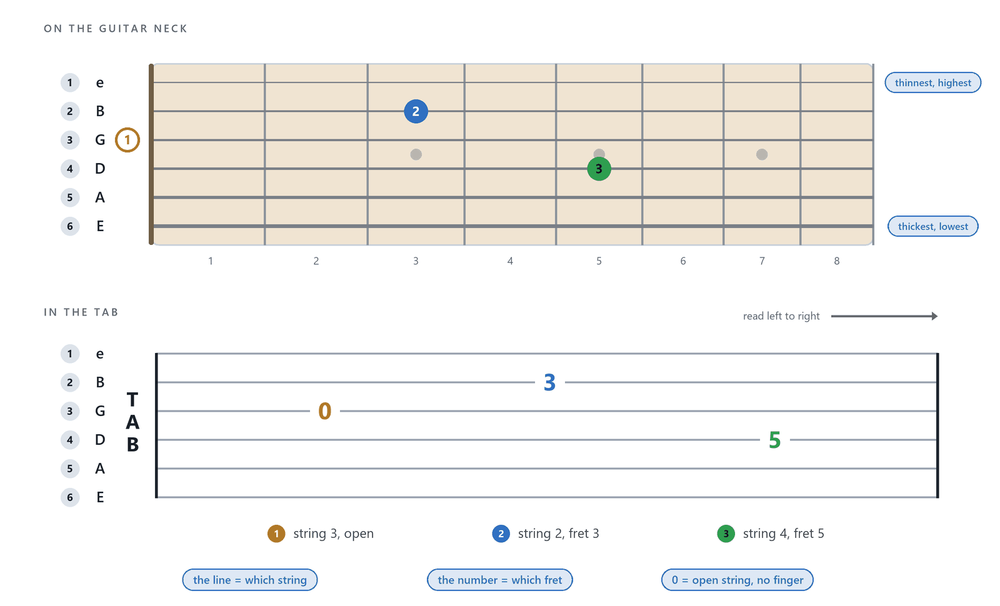
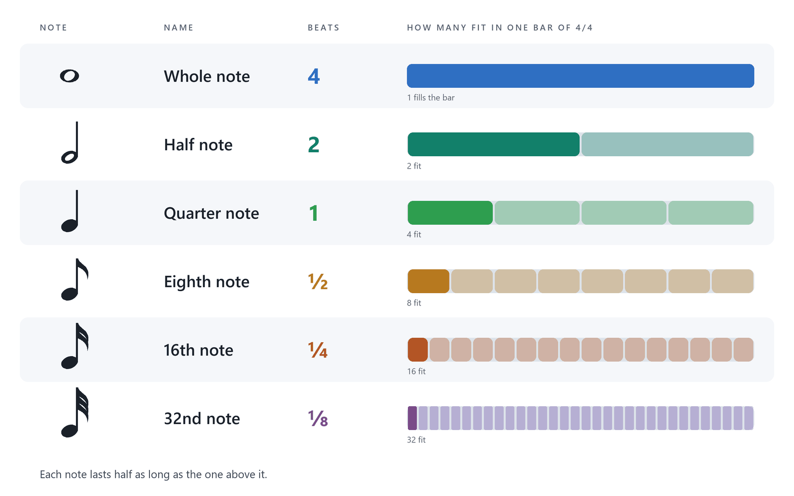

# Reading tab and notation

Before you write music, you need to read it. A bar of tablature (TAB) tells you where to put your fingers. A few more marks tell you when to play and for how long.

In this chapter you read real bars from the demo song. By the end you can say which strings and frets to play, how long each note lasts, and where in the song you are.

## What you will learn

- Read a TAB staff: which line is which string, and what a fret number means.
- Work out how long each note lasts from beams, dots, ties, rests and triplets.
- Recognise the basics of standard notation: staff, clef, note heads and signatures.
- Understand bar numbers, section names, repeats, tempo marks and dynamics.
- Switch between TAB and notation, and use the fretboard, keyboard and drum map as a second view.
- Ask the scale finder which scale a passage uses.

## What is tablature

Tablature (TAB) is the neck of your instrument written down. Each line stands for one string, and each number says which fret to press on that string. You read it from left to right, and the notes come in the order you play them.

TAB shows where to play, not how long to hold each note. The rhythm marks, further on, say that.

## Reading one TAB staff

A guitar TAB staff has six lines, one for each string. The top line is the thinnest, highest-pitched string, which is string 1. The bottom line is the thickest, lowest string, which is string 6. This matches how the strings look when you look down at your guitar.

*Figure: the lines of a TAB staff, and the strings they stand for.*

A number on a line is the fret to press on that string. A `0` means the open string, played with no finger on it. A `5` means press fret 5. Numbers stacked above each other, at the same point in the bar, are played together as a chord.

A bass has four or five lines, and a seven-string guitar has seven. The top line is always the highest string.

### Try it: Read a bar

*Goal: name the string and fret of four notes, and check them on the fretboard.*

1. Open **Ashen Meridian** with **File > Open…**, then click the **Clean Gtr** track in the track list.
2. Press `Ctrl+G`, type `2`, then press `Enter`. The edit cursor moves to bar 2, in **Intro: Embers**.
3. Look at the first four notes of the upper part of the bar. For each one, name the string and the fret. The two lower numbers belong to a bass line played at the same time, so leave them for now.
4. Click the first of the four notes. The edit cursor moves to it, and the fretboard shows where it is.
5. Click the other three notes in turn.
6. Compare your answers with the list below.

Check yourself:

- First note: string 4, fret 2.
- Second note: string 3, fret 0 (open).
- Third note: string 2, fret 0 (open).
- Fourth note: string 1, fret 2.

You know it worked when the fretboard shows each note on the string you named. The Clean Gtr track uses a capo, so fret numbers count from the capo, not from the nut.

> **Note:** A click in the score only moves the edit cursor. It never adds a note. While the song plays, a click also moves playback to that bar.

## How long is each note

TAB has numbers but no rhythm of its own, so most beginners get stuck here. TabForge draws the rhythm under the TAB numbers and above them in the notation. This is a one-page guide.

Music is counted in beats, the pulses you tap your foot to. A bar holds a fixed number of beats, set by the time signature. In 4/4 a bar holds four quarter-note beats.

Each note has a note value, which is how long it lasts compared with a whole bar of 4/4.

- A whole note lasts four beats, a full bar of 4/4.
- A half note lasts two beats.
- A quarter note (crotchet) lasts one beat.
- An eighth note (quaver) lasts half a beat, so there are two per beat.
- A sixteenth note (semiquaver) lasts a quarter of a beat, so there are four per beat.

*Figure: each note value is half as long as the one above it.*

Short notes are beamed together. Eighth notes in a row share a beam, and sixteenth notes share a double beam. A single eighth note has a flag instead. A hollow note head is a half or whole note, and a filled head is a quarter or shorter.

Count a bar of eighth notes as "1 and 2 and 3 and 4 and". Every number is a beat, and every "and" falls halfway between two beats.

Four more marks change how long a note lasts.

- A **dot** after a note makes it half as long again. A dotted quarter note lasts a beat and a half.
- A **tie** is a curved line joining two notes of the same pitch. You play the first and hold through the second.
- A **rest** is a silence. It has its own length, written with its own symbol.
- A **triplet** squeezes three notes into the time of two. It is marked with a small 3 over a bracket.

A bar must add up. In 4/4 the notes and rests must total four quarter notes. A bar that does not add up turns red, and **Chapter 14: Troubleshooting and FAQ** explains how to fix it.

Here are real examples from the demo song. Each name comes first, then the bar.

- **Intro: Meridian** (bars 11 to 18) on **Rhythm Gtr L** has power chords. In bar 15 each chord is a stack of numbers.
- **Intro: Meridian** on **Lead Gtr**, bar 15, begins with a dotted quarter note followed by an eighth note.
- **Intro: Embers** on **Clean Gtr** has a note tied across the bar line, from bar 9 into bar 10, and a rest in bar 10.
- **Rhythm Gtr L** bar 10 (the **Swell**) starts with a half rest and an eighth rest. Bar 19, beat 4, in **Verse 1** holds a triplet.

## Standard notation in a minute

Below the TAB sits standard notation, the five-line staff. You can read only TAB if you like. But notation shows something TAB cannot: the pitch of each note, whichever string you play it on.

- A **staff** has five lines. Notes sit on the lines and in the spaces between them. Higher on the staff means higher in pitch.
- A **clef** at the start of the staff says which pitch each line stands for. Guitar music uses a treble clef, written an octave higher than it sounds. Bass music uses a bass clef. Each line of notation opens with the clef of its own track, and a bar that changes clef shows a smaller clef at its start.
- A **note head** and its stem show the pitch and the note value.
- A **key signature** is a group of sharps or flats at the start, telling you which notes are raised or lowered throughout.
- A **time signature** is two numbers: beats in each bar on top, note value of one beat below.

A single eighth note has a full flag. A slide shows as a short slanted stroke in both staves, and a hammer-on or pull-off shows as a curved slur in both staves. A harmonic is written at the pitch you hear, with a diamond note head. Ledger lines, the short lines above and below the staff, are drawn exactly like the staff lines, so they are as light as the staff.

> **Tip:** TAB tells you where to play. Notation tells you what it sounds like.

## Marks above and around the staff

A score carries more than notes. Text and signs around the staff tell you where you are and how to play.

- **Bar numbers** sit above each bar. A song is counted in bars, so "bar 40" always means the same place.
- **Section names** such as **Chorus 1** (bar 40) appear above the first bar of a section.
- **Tempo marks** show a note symbol, an equals sign and a number. The demo song starts at 150 BPM, drops to 112 at the **Breakdown: Meridian Falls** (bar 91) and returns to 150 at the **Solo** (bar 102).
- **Dynamics** are letters for loudness: `p` is soft, `mf` is medium loud, `f` is loud, and `ff` and `fff` are louder still. **Intro: Embers** starts at `p` and reaches `mf` at bar 6.
- **Chord names** such as Am(add9) sit above the staff, as in **Clean Gtr** from bar 2.
- **Text** is a free note to the player. **Clean Gtr**, bar 2, says to let the notes ring.
- **Technique marks**, such as a palm mute or a bend, sit above the staff. **Chapter 6: Techniques and effects** explains each one.

Repeat and ending signs send you back or ahead. A repeat sign is a bar line with two dots. When you reach the closing one, you go back to the opening one and play the passage again. Numbered endings (1., 2.) mean a different finish on each pass.

In **Verse 1**, bars 19 to 22 are repeated. The first time you play bars 19 to 22, then go back. The second time you play bars 19 to 21, skip bar 22 and play bar 23. The **Post-chorus** (bars 48 and 49) repeats three times, shown by x3.

Three more signs jump around the song. A **segno** is a sign you can jump back to, and **D.S.** (dal segno) means go back to it. A **coda** is a closing passage, and **to Coda** says when to jump to it. The demo song places a segno at bar 36 in the **Pre-chorus 1**, and "to Coda" at bar 39. At the end of the **Solo**, bar 117, a D.S. al Coda sends you back to the segno. At the "to Coda" you jump to the **Coda: Lift** at bar 118. TabForge follows these signs when it plays.

## Time and key signatures

A time signature and a key signature apply from the bar where you set them, on every track, until the next change. You do not set them again on each bar. The dialogs that set them have an **Only this bar** box for a one-bar change, and when several bars are selected the change applies to exactly those bars.

The demo song shows both. Bar 1 is a one-beat opening bar, with a time signature of 1/4. Bar 2 begins 4/4. The **Swell** (bar 10) is a single bar of 3/4. The **Bridge** is in 7/8 for bars 83 to 86. The **Coda: Lift** (bar 118) is one bar of 2/4. The key is A minor, and it moves to B minor at the **Coda: Lift** (bar 118), in time for the **Final Chorus**.

Because the signature belongs to a bar, the toolbar shows the signatures of the bar you are on, and only the bar where a signature changes prints it. **Chapter 5: Writing your first riff** shows how to set one.

## Choose your view

By default TabForge shows TAB and standard notation together. Open the **View** menu to show only one of them. It has three choices.

- **Tablature + standard** shows both.
- **Tablature only** hides the notation and shows only the TAB.
- **Standard notation only** hides the TAB.

With the score selected, press `Tab` to move to the next view and `Shift+Tab` to go back. 

> **Note:** In **Standard notation only** view, a digit you type chooses a string, not a fret. Switch to a view with TAB when you want to write frets (see **Chapter 5: Writing your first riff**).

To change the size of the score, choose **Fit width** or a percentage in the zoom box in the **Zoom & speed** tab, or press `Ctrl+Plus` and `Ctrl+Minus`. **View > Dark score page** and **Light score page** change the paper. The score is one continuous page that scrolls down; right-click empty paper for **Page layout** to scroll sideways instead.

### Try it: Three views

*Goal: see the same bar in all three views.*

1. Click the **Lead Gtr** track, press `Ctrl+G`, type `40` and press `Enter`. The edit cursor moves to the start of **Chorus 1**.
2. Choose **View > Tablature + standard**. You see both staves.
3. Choose **View > Tablature only**. The notation disappears.
4. Choose **View > Standard notation only**. The TAB disappears.
5. Choose **View > Tablature + standard** again. Both staves return.

You know it worked when each choice changes which staves you see and the music stays the same.

## The fretboard, keyboard and drum map

The panel above the score shows the selected track on its own instrument. For a guitar or bass it is a fretboard with the track's own strings. For keys it is a keyboard. For drums it is a drum map. Together they are the instrument panel, a second way to see the same notes.

Click a track in the track list and the score, the instrument panel and the status bar all follow.

A legend in the bottom right corner explains the colours: **now** for sounding notes, **next** for the coming note, **upcoming** for the notes after it, and **recent** for notes played a moment ago. In a fresh installation the position dots at frets 3, 5, 7, 9 and 12 are white, the fret numbers are large and a scale is shaded in blue. You can change these in **Preferences > Fretboard & Keyboard**.

On a guitar or bass, click a fret to write a note at the edit cursor. The keyboard view is for reading, and does not write notes. Every pad of the drum map writes its hit at the cursor, on the line given by the track's drum notation preset.

Right-click the panel to open the fretboard menu, or focus the panel and press `Shift+F10` or the `Menu` key. It offers **Show this track as** (fretboard, keyboard or drums), **Scale**, **Note names**, **Preview next notes**, **Left-handed** and **Fretboard settings…**. The **Fretboard** box in the **Practice / Mixer** tab shows 12 or 24 frets.

## Find the right notes with scales

A scale is a set of notes that sound good together. If you know the scale of a passage, you know which notes are safe to play over it. The scale finder listens to the notes in your song and suggests which scales fit.

Open it with **Tools > Scale finder…**, or click the **Scales** button below the legend. **Search the notes in** picks **Selection** (the bars you selected) or **Entire song**, and **All tracks** includes every track.

The **Likely scales** tab ranks scales by the share of the notes that fit. The **All scales** tab lets you choose a **Key (root)** and scale yourself. **Show on fretboard** lights the scale, and **Clear highlight** removes it. In **Preferences > Fretboard & Keyboard > Appearance**, **Scale highlight strength** sets how bright it is, from 10% to 150%, where 100% is the standard look and the root note is always stronger.

### Try it: Ask the scale finder

*Goal: find the scale of the Chorus 1 melody and see it on the fretboard.*

1. Click the **Lead Gtr** track.
2. Drag across bars 40 to 47 on the timeline to select **Chorus 1**.
3. Choose **Tools > Scale finder…**. The **Scale finder** window opens on the **Likely scales** tab.
4. Read the top result. It names a scale and the share of the notes that fit.
5. Click the top result, then click **Show on fretboard**. The scale lights up on the fretboard.
6. Click **Clear highlight**, then **Close**.

You know it worked when the notes of the scale light up on the fretboard, and disappear when you clear the highlight.

**Stuck?** See **Chapter 14: Troubleshooting and FAQ**.

## Quick recap

- A TAB staff has one line per string. The top line is the thinnest string. A number is a fret, and `0` is an open string.
- Note values halve each step: whole, half, quarter, eighth, sixteenth. Dots, ties, rests and triplets change the length.
- A bar must add up to its time signature. Time and key signatures apply from their bar until the next change.
- Bar numbers, section names, tempo marks, dynamics, repeats and chord names tell you where you are and how to play.
- **View** switches between TAB with notation, TAB only and notation only.
- The fretboard, keyboard and drum map show the selected track. The scale finder suggests scales that fit your notes.

## What next

You can now read a bar and know what to play and for how long. Go on to **Chapter 5: Writing your first riff**, where you write a four-bar riff of your own.
