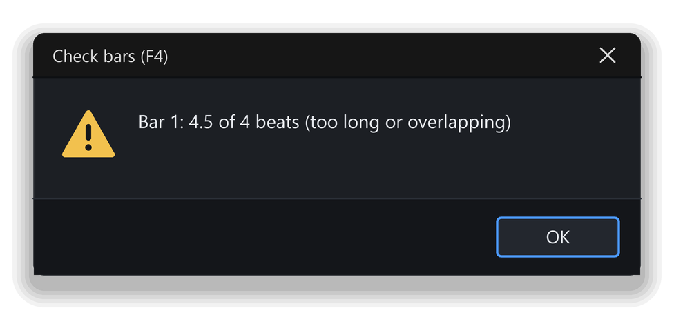

# Writing your first riff

Reading music is half of TabForge. The other half is writing it. In this chapter you build a tiny four-bar riff from nothing, hear it, and save it as **My first riff**.

A riff is a better first project than a whole song. It is short enough to finish in one sitting, and it still uses everything you need: frets, note values, rests, chords, copy and paste. Later chapters keep adding to this riff.

## What you will learn

- Start a new song and set its title, tempo and key.
- Move the edit cursor and type fret numbers.
- Choose note values, and use dots, rests, triplets and ties.
- Understand why a bar turns red, and fix it.
- Enter a chord, including by clicking the fretboard.
- Select, copy, paste, insert and delete beats and bars, and undo a mistake.
- Play your riff and save it.

## The plan: four bars

The riff is in A minor at 100 BPM, in 4/4 time, for a guitar in standard tuning. Strings are counted from the thinnest: string 1 is the thinnest and string 6 the thickest. The A string is string 5.

| Bar | What you write |
|---|---|
| 1 | Eight eighth notes (quavers) on string 5: frets `0 0 3 0 0 5 3 0` |
| 2 | Eight eighth notes on string 5: frets `0 0 3 0 0 5 7 5` |
| 3 | Three two-note chords on strings 6 and 5: a quarter note at frets `5` and `7`, a quarter note at `3` and `5`, a half note at `1` and `3` |
| 4 | One whole-note chord: string 6 at fret `0` and string 5 at fret `2` |

The chords in bars 3 and 4 are power chords: two notes, a root and its fifth. In TAB, bar 1 is a single line of numbers on string 5, and bar 3 is two numbers stacked on strings 6 and 5.

If you want to start somewhere other than the beginning, the guide's downloads include `first-riff-05-empty.gp` (a blank song with the tempo set) and `first-riff-05.gp` (the finished riff from this chapter). Open one with **File > Open…**.

## Start a new song

A new song is blank and ready to use. There is no set-up wizard. You change the title, tempo and key afterwards.

1. Choose **File > New** (`Ctrl+N`). A new document tab named **Untitled** opens, with one **Guitar** track and 32 empty bars.
2. Choose **File > Score information…** (`F5`). The **Score information** window opens.
3. Click the **Title** box and type `My first riff`.
4. Click **OK**. The title now appears in the document tab.
5. Click the **BPM** box in the toolbar at the top right and type `100`.
6. Press `Enter`. The tempo is now 100 BPM, within the allowed range of 20 to 400.
7. Choose **Bar > Key signature…** (`Ctrl+K`). The **Key signature** window opens.
8. Leave the **Key** list on **C**, tick **Minor mode** and click **OK**.

A minor shares its key signature with C major, so the score shows no sharps or flats. The time signature is already 4/4, so you do not need to change it. The key and the time signature apply from the bar where you set them, on every track, until the next change; you set both on bar 1, so they cover the whole riff.

> **Tip:** The **Project settings** button at the right end of the toolbar holds the title, tempo, time signature and key in one window, if you prefer a single place.

## Move the cursor and type frets

The edit cursor is the highlight that shows where the next note will go. It marks a beat and a string. Everything you type acts there.

The arrow keys move it. `Left` and `Right` move one beat, and `Up` and `Down` move one string. Hold `Ctrl` with `Left` or `Right` to move a whole bar. `Home` jumps to the start of the bar.

To write a note, type its fret number. Digits `0` to `9` write frets 0 to 9. For frets 10 and above, type both digits within 0.7 seconds of each other. When you enter a new note, the cursor moves on by the length of that note, ready for the next one. That is how a whole bar goes in without touching the mouse.

Try the cursor before you write the riff.

1. Click the empty bar 1 in the score, on the fifth line down from the top of the TAB lines. That line is the A string. The cursor appears there.
2. Press `Home`. The cursor moves to the first beat of the bar.
3. Type `0`. A quarter note on fret 0 appears, and the cursor moves to the next beat.
4. Type `0` again. A second note appears next to the first.

You hear each note as you enter it. These two notes are quarter notes because that is the note value a new song starts with. The next section changes that. Press `Ctrl+Z` twice to take both notes back.

> **Tip:** If you type a wrong fret, type the right one over it. You do not need to delete the note first, and its length stays the same. `Backspace` deletes the note on the cursor's string, and `Delete` clears the whole beat.

## Choose a note value

A note value is how long a note lasts: a whole note, a half note, a quarter note, an eighth note and so on. Here the note value works as a mode. The value you choose is used for the next note you write, until you choose another. The status bar shows the current value, such as quarter or eighth.

Choose a value from the **Duration** group on the **Tools** page of the side panel, or from the **Note** menu (**Whole**, **Half**, **Quarter**, **Eighth**, **Sixteenth**, **32nd**, **64th**). The seven sizes have no default keys. Hover a **Duration** button to read its name and, if it has one, its current key.

The same choice works two ways. With the cursor on an empty beat, it sets the value for the next note. With the cursor on a written note, or with beats selected, it changes that note instead. The highlighted button always shows the value of the beat under the cursor.

A few more keys shape the rhythm.

- `Full stop` (the `.` key) adds a dot, which makes the note half as long again. Press it again for a second dot, and a third time to remove them.
- `Slash` (the `/` key) toggles a triplet: three notes in the time of two.
- `R` turns the beat into a rest, a silence. Press `R` again to turn it back. Typing a fret on a rest writes a note of the rest's length.
- `L` ties a note to the one before it, so the sound continues across both.
- `-` (**Longer note value**) and `+` (**Shorter note value**) step the note value one size at a time. Press one and watch the status bar, or click a **Duration** button for a certain result.

### Try it: Write the first two bars

*Goal: type bars 1 and 2 of the riff and hear them.*

1. Click bar 1 on the fifth line of the TAB, then press `Home`. The cursor is on the A string at the start of bar 1.
2. In the **Duration** group, click the eighth note button. The status bar now shows eighth.
3. Type `0`, `0`, `3`, `0`, `0`, `5`, `3`, `0`, one key at a time. Eight notes fill bar 1, and the cursor moves on to bar 2.
4. Type `0`, `0`, `3`, `0`, `0`, `5`, `7`, `5` for bar 2.
5. Press `Ctrl+Home`. The cursor returns to the start of bar 1.
6. Press `Space`. You hear the two bars, then silence, because the song has 32 bars and only two are written.
7. Press `Space` again to pause.

You now have the sound of the riff. The silent bars after it are harmless; you will not use them yet.

## Fix a bar that does not add up

Every bar holds a fixed amount of music. A bar in 4/4 holds four quarter notes, or eight eighth notes. TabForge lets you write a bar that is too long or too short, so you are never blocked in the middle of an idea. It shows you the problem instead: the bar turns red.

> **Note:** Red is a warning, not an error. The song still plays, but the bar is longer or shorter than its time signature says.

The status bar shows how full the bar is, as two numbers: the music written, then the length the bar should have, both counted in sixteenth notes. A full bar of 4/4 reads 16:16. A bar that is two sixteenths too long reads 18:16.

### Try it: Fix a red bar

*Goal: make a bar overfull on purpose, find it, and put it right.*

1. Click the first note of bar 1. The cursor sits on it.
2. In the **Duration** group, click the quarter note button. The first note becomes a quarter note, and the bar now holds more than four beats.
3. Look at bar 1 and at the status bar. The bar turns red, and the readout changes to 18:16.
4. Press `F4`, or choose **Tools > Check bar duration**. A message lists bar 1 as a bar that does not add up.
5. Click **OK**. Then press `Ctrl+Z`. The first note is an eighth note again, and the red goes away.

*Figure: the result of Check bar duration.*

If you would rather be stopped than warned, open **Preferences > Editing**, open **More options** under **Note entry**, and tick **Prevent rhythms that overfill a bar**. Changes that would overfill a bar are then refused.

## Write chords with the fretboard

A chord is two or more notes on the same beat. Typing a fret moves the cursor on, so a typed note cannot share a beat with the next. There are two ways round this. You can click the notes on the fretboard, or you can type the last note of the chord last.

The fretboard is the picture of the neck above the score. Clicking a string at a fret toggles a note there at the cursor beat: click once to write it, click the same place again to remove it. A click does not move the cursor on, so several clicks build a chord. As you move the mouse over the fretboard, a faded note shows where a click would write. The fretboard works for guitar and bass tracks.

A click on an empty beat uses the current note value, the same as typing. So choose the value first.

### Try it: Add the chords

*Goal: write bars 3 and 4 from the fretboard.*

1. Press `Ctrl+Home`, then press `Ctrl+Right` twice. The cursor is on the first beat of bar 3.
2. In the **Duration** group, click the quarter note button.
3. On the fretboard, click string 6, the thickest string, at fret 5. A note appears on the lowest line of the TAB.
4. Click string 5 at fret 7. The beat now holds two notes: an A5 chord.
5. Press `Right`. The cursor moves to the next beat. Click string 6 at fret 3, then string 5 at fret 5.
6. Press `Right`. In the **Duration** group, click the half note button. Click string 6 at fret 1, then string 5 at fret 3.
7. Press `Right`. The cursor moves to bar 4. In the **Duration** group, click the whole note button.
8. Click string 5 at fret 2. Press `Down`, then type `0`. The cursor was on string 5; `Down` moves it to string 6, and the typed `0` completes the E5 chord.

You wrote one chord by clicking and one by typing. Both give the same result: notes stacked in one beat. After step 8 the cursor moves on, because a typed note advances the cursor.

> **Note:** To enter a whole chord by typing, switch off **Advance after entering a note** in **Preferences > Editing**, under **Note entry**. Then `Up` and `Down` choose the string and a digit writes the fret, and the cursor stays on the beat.

Your four bars are done.

## Edit like a pro

Typing is only part of editing. You also need to undo, select, copy and rearrange.

**Undo and redo.** Press `Ctrl+Z` to undo and `Ctrl+Y` to redo. Each edit is one step, and every tab keeps up to 200 steps. Press `Ctrl+Z` freely: it is the quickest way to try something.

**Select beats.** A selection is a stretch of beats you act on together. There are three ways to make one.

- Drag across the beats. Press and hold for a moment, then drag sideways; a quick click stays a click.
- Hold `Shift` and press `Left` or `Right`. The selection grows one beat at a time.
- Click the first beat, then hold `Shift` and click the last beat. The selection covers everything between them.

Press `Ctrl+A` to select the whole track. Press `Esc` to clear the selection. While a song plays, the next `Esc` stops it.

**Copy, cut and paste.** Press `Ctrl+C` to copy the selection, or the beat on the cursor if nothing is selected. `Ctrl+X` cuts; the cut beats become rests. Click where the copy should go and press `Ctrl+V`. Paste asks a question only when it needs an answer, for example whether to replace or insert. `C` is a shortcut for one beat: it copies the previous beat onto the cursor beat.

**Insert and delete.**

- `Insert` adds an empty beat at the cursor and pushes the rest of the bar to the right. This needs NumLock on, because with NumLock off the same key types fret 0.
- **Edit > Delete beats** removes the beat on the cursor and pulls the rest of the bar left. It has no default key.
- **Bar > Insert bar** (`Ctrl+Insert`) adds an empty bar before the cursor bar, on every track.
- **Bar > Delete bar** (`Ctrl+Delete`) removes the cursor bar from every track. The last bar cannot be deleted.
- **Bar > Duplicate bar** copies the cursor bar and puts the copy after it, on every track. With bars selected, it copies the whole selection after its last bar and selects the copy. A section label is not repeated on the copy.

Pitch has its own keys. `Shift+Up` and `Shift+Down` raise or lower the note under the cursor by a semitone, which is one fret. `Alt+Shift+Up` and `Alt+Shift+Down` instead move the note to the next higher or lower string and keep its pitch, so the fret number changes. If the pitch cannot be played there, or the string already has a note on that beat, nothing moves and the status bar says why. `Alt+Left` and `Alt+Right` step to the previous or next note you have entered.

> **Tip:** `Shift+F10`, or the `Menu` key, opens the right-click menu at the cursor, so you can reach it without the mouse. Clicking empty paper in the score keeps the keyboard working in the score.

### Try it: Copy a bar and undo it

*Goal: copy bar 1 to a later bar, then undo it so the riff stays as written.*

1. Click the first beat of bar 1. Then hold `Shift` and click the last beat of bar 1. The whole bar is selected.
2. Press `Ctrl+C`.
3. Press `Ctrl+Home`, then press `Ctrl+Right` four times. The cursor is on the first beat of bar 5, which is empty.
4. Press `Ctrl+V`. A copy of bar 1 appears in bar 5.
5. Press `Ctrl+Z`. Bar 5 is empty again.

## Play it and save it

Press `Space` to play from the edit cursor, and `Space` again to pause. Press `Ctrl+Home` first to start from bar 1. The song plays on through the empty bars, so press `Space` once the last chord has finished. A line moves across the score as the music plays.

Now save your work. The document tab shows a dot while there are unsaved changes.

1. Choose **File > Save** (`Ctrl+S`). A window for saving the song opens, because the song is new.
2. Type `My first riff` in the file name box.
3. Leave the file type on the first choice in the list, which is a `.gp` file. **Chapter 12: Saving, sharing and exporting** explains what that means.
4. Choose a folder, such as your Documents folder, and click **Save**. The dot disappears from the document tab.

Your song now matches the plan at the start of this chapter. Chapter 6 starts from this riff. If you want a fresh copy, open `first-riff-05.gp` from the guide's downloads.

## More options

**Preferences > Editing** holds the settings for note entry. **Default note value** and **Advance after entering a note** are always visible. The others sit behind the **More options** toggle of their group.

- **Default note value** sets the value a new song starts with.
- **Advance after entering a note** turns the automatic move to the next beat on or off.
- **Reverse + / - duration keys** swaps what `+` and `-` do.
- **Prevent rhythms that overfill a bar** refuses changes that would turn a bar red.
- **Score wheel scroll distance**, in **Mouse and scrolling**, sets how far one wheel notch scrolls the score.
- The **Copy and paste** group has one question for each kind of paste. Each can ask every time, or remember your choice.

Letter keys are commands. `R` is a rest, `S` a slide and `P` a palm mute. If a key seems to do something odd, check where the keyboard focus is. Inside a text box, letters type letters instead.

In the **Standard notation only** view, a digit chooses a string, not a fret. Switch back to **Tablature + standard** from the **View** menu for normal entry.

## Quick recap

- **File > New** (`Ctrl+N`) opens a blank song with one **Guitar** track and 32 bars. Set the title with `F5`, the tempo in the **BPM** box and the key with `Ctrl+K`.
- The edit cursor marks the beat and string. Arrows move it, and a digit writes a fret and moves on.
- The note value is a mode. Choose it from the **Duration** buttons, then write. On a written note, the same choice changes that note.
- A bar that does not add up turns red. `F4` lists every such bar.
- Click the fretboard for a chord, or type its last note last. Use `Ctrl+Z` freely.
- Select with a drag, `Shift` and the arrows, or `Shift` and a click. Copy, cut and paste with `Ctrl+C`, `Ctrl+X` and `Ctrl+V`.
- Save with `Ctrl+S`. A new song asks for a name the first time.

## What next

Your riff has the right notes but plays them plainly. Go on to **Chapter 6: Techniques and effects**, where you add a palm mute, a slide and vibrato so that it sounds like a guitar.
