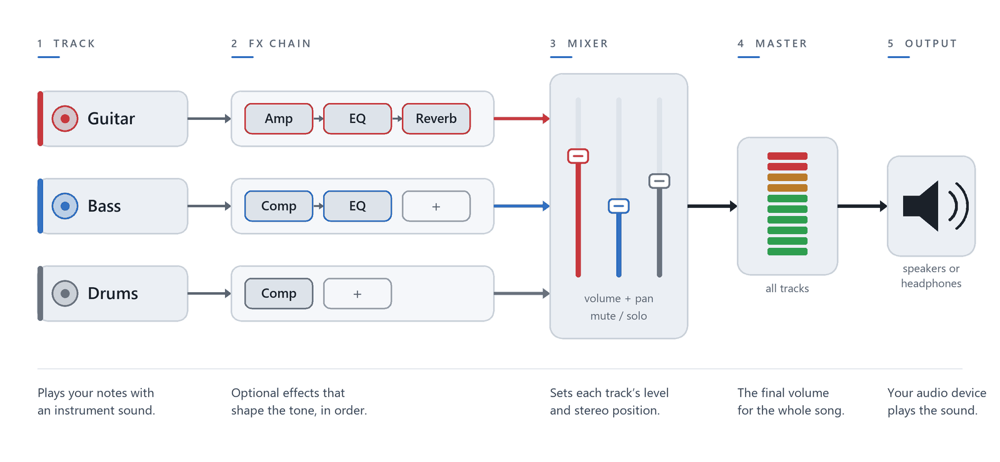

# Shaping the sound

A song with several tracks only sounds good when the tracks sit well together. The drums must not bury the bass, and the two guitars need their own space. This chapter shows how to set that balance, using only what comes with TabForge.

You do not need any plug-ins here. By the end you will have balanced the first riff, changed a sound in the middle of a song, and know where to look when you hear nothing.

## What you will learn

- Understand where the sound of a track comes from.
- Set a track's volume and pan, and mute or solo it.
- Use the Mixer window to balance tracks and groups.
- Change a track's instrument sound.
- Change volume, pan or tempo partway through a song with the Mix Table.
- Choose a safe audio output and check it when there is no sound.

## Where the sound comes from

Notes are only instructions. They need a sound source to become something you hear. By default, TabForge plays every track with its own audio engine, using the General MIDI sound bank that comes with Windows. This guide calls it the **GM sound**.

*Figure: the path from a track's notes to the speakers. With only the GM sound, the effects chain stays empty.*

Be aware of two limits. You cannot swap the GM sound for another sound bank, because there is no sound-font picker. And the per-track **Reverb** and **Chorus** values, which you meet later in the Mix Table, do not change what you hear with the GM sound. For a real reverb, use an effect plug-in, as shown in **Chapter 10: Plug-ins, effects and audio devices**.

Everything else in this chapter works with the GM sound: volume, pan, mute, solo, groups, the master level and instrument changes.

## Volume, pan, mute and solo

Each row in the track list has its own controls. Volume sets how loud the track is, and pan places it between the left and right speakers.

- **Volume** runs from 0 to 127. The default is 100.
- **Pan** runs from -64 (fully left) through 0 (centre) to +63 (fully right).
- Drag a slider, or point at it and turn the mouse wheel. One notch moves one step; hold `Ctrl` while scrolling to move eight steps.
- Double-click a slider to reset it: volume returns to 100 and pan to the centre.
- Right-click the pan control for **Centre pan**, or **Set exact pan…** to type a value from -63 to +63. A right-click on any control of a track row reaches that control, not **Track properties**; only a right-click on the row's own background opens the properties.

### Type an exact value into a knob

Some controls are round knobs rather than sliders. You find them in **Track properties** (`F6`), as the **Master volume** knob, and in the track list if you choose **Knob** for **Track volume control** or **Track pan control** in **Preferences > Timeline & Tracks**.

Drag a knob to change it, or scroll over it. To set an exact value, double-click the knob, right-click it, or focus it and press `F2` or `Enter`. A small box opens. Type a value and press `Enter`, or press `Esc` to cancel.

To return a knob to its default, hold `Ctrl` and click it.

> **Tip:** Type what you mean. In **Track properties**, volume takes a percentage such as `75%` and pan takes `L30`, `R5` or `Centre`. The **Master volume** knob also takes `50%`.

### Mute and solo

Two buttons on every track row help you listen. **Mute track** (**M**) silences that track. **Solo track** (**S**) silences every other track, so you hear only the soloed one. Group rows in the Mixer have their own mute and solo, and soloing a group silences the other groups.

Muting and soloing change only what you hear. They never change the notes in the song.

> **Tip:** Solo each track in turn and listen to it alone. It trains your ear to hear what every part contributes.

### The master volume knob

The round **Master volume** knob sits at the right of the timeline header. It sets one level for the whole song, from 0% to 100%, and the default is 100%. Drag it, scroll over it, or type a value as described above. Lower it first whenever the music is too loud, before you touch any track.

## The Mixer window

The track list shows one track at a time. The **Mixer** window shows them all together, which makes balancing easier. Open it with the **Mixer** button beside the tuning fork in the timeline header, or choose **View > Mixer / VST**.

Each track is a row, with its **FX** button, a **MIDI** tick, **PITCH**, **PAN**, **VOLUME**, and the mute and solo buttons. Tracks sit inside group panels such as **Guitars**, **Basses** and **Drums**. Hover over any Mixer control to read what it does and the key that runs it, if it has one.

Use the **Group tracks** list at the top to change how tracks are grouped.

- **By instrument** makes groups for guitars, basses, keys, drums and other tracks.
- **Compact** keeps guitars, basses and drums, and puts everything else together.
- **No groups** puts every track in one group named **All tracks**.

### The Master row and group rows

The **Master** row is the first row in the window. It holds the **Master volume** fader, the same level as the knob in the timeline header, and a pan fader that shifts the whole mix left or right.

Each group has its own row above its tracks. Its volume is a percentage of every track's own level, from 0% to 200%, where 100% means no change. Its pan and pitch are offsets added to every track in the group. This lets you lower all the guitars at once without moving each one.

To move a track to another group, right-click its row and choose **Move to** followed by the group name. You can also drag a row to a new place, or select a row and press `Alt+Up` or `Alt+Down`. Press `Esc` to close the Mixer.

> **Note:** TabForge has a second table called **Track mixer (detailed)**, in the **Practice / Mixer** panel. It edits the same tracks, but this guide always means the Mixer window unless it names the other one.

## Balance a mix

A good balance has a plan. This four-step recipe works for most songs.

1. Set a known starting level. Leave the **Master volume** at 100% and set your computer's volume to a comfortable, quiet level.
2. Bring up the drums and the bass first. They carry the beat and the low end.
3. Place the other instruments. Pan guitars a little left and right, and keep the bass and the lead part near the centre.
4. Leave room for the lead. If the lead is hard to hear, lower the parts around it before you raise the lead.

In the demo song, the two rhythm guitars are already placed for you: **Rhythm Gtr L** is hard left and **Rhythm Gtr R** is hard right.

> **Tip:** Mix at a low volume. If the balance sounds good quietly, it sounds good loudly too.

### Try it: Balance the riff

*Goal: balance the drums, bass and guitar of My first riff.*

This exercise uses the optional download `first-riff-08.gp`, which comes with the guide. It holds the guitar, a bass and a drum beat.

1. Choose **File > Open…** (`Ctrl+O`) and open `first-riff-08.gp`.
2. Press `Space` to play, and listen for a few seconds. Press `Space` again to pause.
3. Drag the guitar track's volume slider to 100.
4. Drag the bass track's volume slider to 90.
5. Drag the drums track's volume slider to 95.
6. Drag the guitar track's pan slider a little to the left, to about -20.
7. Press `Space` to play again. The guitar sits slightly left, and the three tracks are even.
8. Optional: open `first-riff-09.gp` and compare. It holds the same mix.

You can open the **Mixer** at any point and make the same changes there.

### Try it: Pan the guitars

*Goal: hear what the demo's pan placement adds.*

1. Choose **File > Open…** (`Ctrl+O`) and open `TabForge Demo - Ashen Meridian.gp` from the `Samples` folder.
2. Open the **Mixer** (**View > Mixer / VST**).
3. Press `Space` and listen for a few bars at a low volume.
4. Double-click the pan slider of **Rhythm Gtr L**. It jumps to the centre.
5. Double-click the pan slider of **Rhythm Gtr R**. It also jumps to the centre.
6. Listen again. The two guitars now sit together in the middle, and the sound is narrower.
7. Drag the **Rhythm Gtr L** slider fully left and the **Rhythm Gtr R** slider fully right. The width returns.
8. Close the document tab without saving. The song on disk never changed.

## Change an instrument sound

A track plays one instrument, such as a clean guitar or a piano. You can change it at any time.

1. Select the track you want to change.
2. Press `F6` to open **Track properties**. The **Instrument** card shows the current sound.
3. Click **Change…**. The instrument catalogue opens, with a search box and pictures.
4. Choose an instrument. The window shows the new name.
5. Play the song. The track now uses the new sound.

The track list has a shortcut. Click the **INSTRUMENT** button on the track row and choose from the list that opens.

## Change the sound inside a song

Sometimes a track needs to change halfway: a guitar that gets quieter for a verse, or a tempo that slows near the end. The **Mix Table** does this from a chosen beat onwards.

Select a beat in the score and press `F10`. The **Mix Table** window opens with these rows, each with its own tick box:

- **Instrument**, **Volume** and **Pan**. Volume runs from 0 to 16 and pan from -8 to 8, in coarser steps than the sliders.
- **Chorus**, **Reverb**, **Phaser** and **Tremolo**. With the GM sound, **Chorus** and **Reverb** do not change what you hear.
- **Tempo (bar)**, to change the speed from this beat.

Tick a row to turn it on, then set its value. The **Transition** list sets how quickly the change arrives: **Immediately**, or over 1 to 8 beats. Tick **All tracks** to apply the change to every track. **Clear** removes the mix point, and **OK** keeps it.

A mix point stays in force until the next one. A red dot above the beat in the score marks each point, and a small red dot in the timeline marks the bar.

### Try it: Duck the volume in a bar

*Goal: make the guitar dip in volume for one bar, then return.*

1. Open `first-riff-09.gp` and select the guitar track.
2. Click the first beat of bar 3 in the score.
3. Press `F10`. The **Mix Table** opens.
4. Tick **Volume** and drag its slider to 6. Leave **Transition** on **Immediately**.
5. Click **OK**. A red dot appears above the beat.
6. Click the first beat of bar 4 and press `F10` again.
7. Tick **Volume**, drag its slider to 12, choose **Over 2 beats**, and click **OK**.
8. Press `Space` to play. The guitar drops in bar 3 and swells back up in bar 4.

Press `Ctrl+Z` for each change if you want to undo the edit, or close the document tab without saving.

## Choose an audio output

The audio output decides which speakers or headphones TabForge plays through. The defaults are the safe choice. Once the audio engine is running, the right side of the status bar shows the driver, the device, and its delay and buffer.

To check or change it, click that button. **Preferences** opens at **Audio & Plug-ins**. You can also open it with `F12`.

As a beginner, keep **Audio driver** on **WASAPI (shared)** and **Output device** on **(Windows default)**. They follow the device you choose in Windows, and they let other programs keep playing sound. **Chapter 10: Plug-ins, effects and audio devices** explains the other drivers.

> **Note:** The other drivers can take the sound device for themselves, so other programs may fall silent while TabForge plays. Stay on **WASAPI (shared)** unless you know you need more.

The **Sound** menu has **Test selected track output**. It plays one test note on the Windows MIDI output of the selected track. That proves the Windows MIDI path works. It does not test TabForge's own audio engine, so a good result does not prove that normal playback works.

## When there is no sound

Almost every case of silence is one of these. Check them in order.

1. Look at **Mute track** and **Solo track** on the track list and in the Mixer. A soloed track or group silences the others.
2. Check the **Master volume** knob and the level of the track or group. None may be at 0.
3. Read the audio device button in the status bar. Is it the speaker or headphones you expect?
4. Open **Preferences > Audio & Plug-ins** and set **Audio driver** to **WASAPI (shared)** and **Output device** to **(Windows default)**.
5. Check the Windows volume and the Windows output device.

If the song still plays nothing, see **Chapter 14: Troubleshooting and FAQ**.

## Quick recap

- Every track plays through the GM sound, which you cannot swap. **Reverb** and **Chorus** do not change it.
- Volume runs from 0 to 127, and pan from -64 to +63. Double-click a slider to reset it.
- Double-click a knob or press `F2` to type an exact value; hold `Ctrl` and click to reset it.
- The **Mixer** shows every track and group, and the **Master** row sets the whole song.
- The **Mix Table** (`F10`) changes sound from one beat onwards, marked by a red dot.
- Keep **WASAPI (shared)** and **(Windows default)** until you have a reason to change.

## What next

Go on to **Chapter 10: Plug-ins, effects and audio devices**. It shows how to add real effects and instruments to a track, how TabForge protects the editor from a crashing plug-in, and when another audio driver helps.
