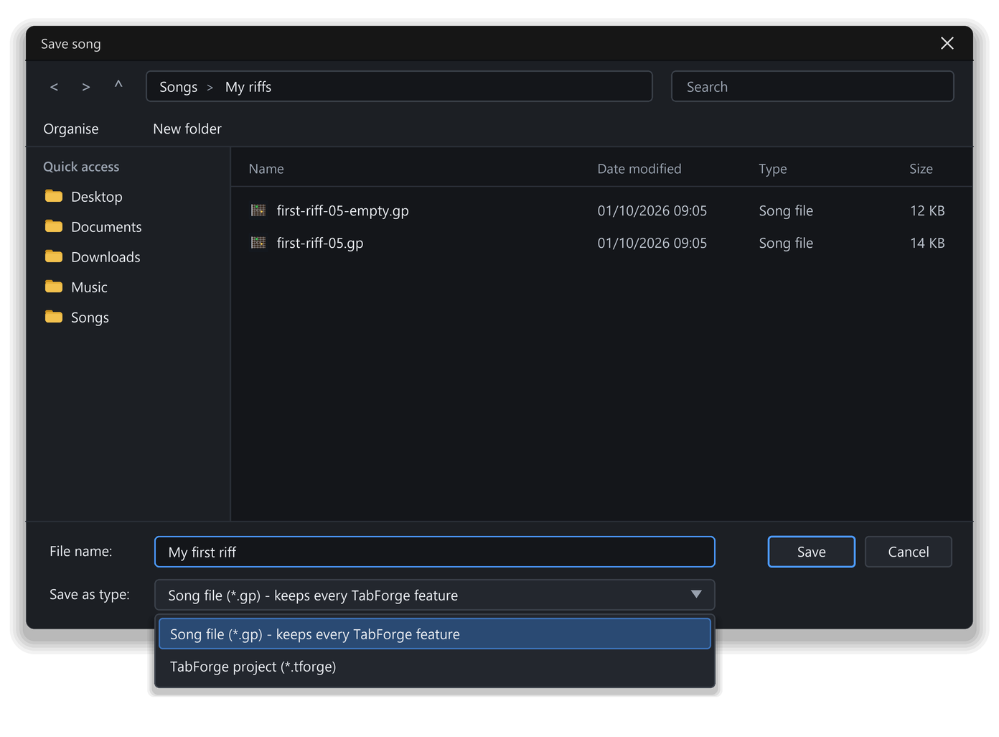

# Saving, sharing and exporting

A song is only safe once it is saved, and it is only useful to others once it leaves TabForge in a form they can use. This chapter covers both: saving without fear, getting work back after a crash, and sending a song out as a PDF, MIDI, text tab or audio file.

Nothing here is hard, but a few details matter. Knowing what each file type keeps will save you from losing settings you worked hard on.

## What you will learn

- Choose between the two file types TabForge can save.
- Save, Save As and recover a song after a crash.
- Open songs, start from a template and fill in song information.
- Export a PDF, MusicXML, MIDI or text tab.
- Render a song to a WAV or MP3 file.

## File types in plain words

TabForge can save two kinds of file. A `.tforge` file is TabForge's own project, and only TabForge opens it. A `.gp` file saved by TabForge is a standard `.gp` file with the whole TabForge project stored inside it as an extra part. Other programs read the standard part and ignore the extra part, and TabForge reads everything back with nothing lost.

If another program saves the `.gp` file again, the extra part is lost. The notes survive, but TabForge-only settings, such as plug-ins and mixer groups, do not. Keep your own copy as your working file.

TabForge opens `.tforge`, `.gp`, `.gpx`, `.gp5`, `.gp4` and `.gp3` files. Everything else leaves TabForge as an export, and exports are for sharing.

| File | Opens in TabForge | Written by | What it keeps |
|---|---|---|---|
| `.tforge` | Yes | Save | Everything in the song |
| `.gp` | Yes | Save | Everything, in an extra part |
| `.gpx`, `.gp5`, `.gp4`, `.gp3` | Yes | Not written | What the file held |
| `.mid` | No | Export MIDI | Notes and tempo, no sound |
| `.musicxml` | No | Export MusicXML | Notation and tab, no sound |
| `.pdf` | No | Export PDF | One track as pictures of pages |
| `.txt` | No | Export ASCII tab | Fret numbers as plain text |
| `.wav`, `.mp3` | No | Render | The finished sound |

## Save a song

Save writes the song to its file. Choose **File > Save** (`Ctrl+S`). Choose **File > Save As…** (`Ctrl+Shift+S`) to save under a new name, in a new folder or as a different type.

A new song has no file name yet, so **Save** asks for one. A song you opened from another file can ask too. If **Save** asks for a name, choose a name and a folder, then click **Save**. The window is called **Save song**, and TabForge adds the extension for you.

*Figure: the Save song window.*

Only the `.gp` and `.tforge` types can be saved. If you type another extension, TabForge refuses and names the types it can write. The type listed first follows **Preferences > Files & Backups**, under **Opening and saving**, in the row **Default save format**. The standard `.gp` type is the default.

While a song has unsaved changes, the window title ends with an asterisk and its document tab shows a dot. Closing a song with unsaved changes opens a window that asks **Save changes to …?** with **Yes**, **No** and **Cancel**. **Yes** saves first, **No** discards the changes and **Cancel** keeps the song open. If you close a whole window that holds several songs with unsaved changes, TabForge asks about each of them in turn, and **Cancel** at any question keeps the window and every song as they were.

When the song uses something a standard `.gp` file cannot hold, such as a long bend curve, a mix change inside a bar or a reverb send, **Save** and the exports tell you first. A window lists what the file would lose and where. You can keep a full `.tforge` copy beside it, write the compatible file only, or cancel. Nothing is written on **Cancel**. Saving the compatible file marks the song saved; an export leaves the song as it was. The command **File > Export compatible .gp file** does the compatible-only save directly; it has no default key.

TabForge saves safely. It writes to a temporary file beside your song and swaps it in only when the write is complete. A crash or a full disk leaves your old file intact.

A recorded clip is linked to its audio file by path, and it is not stored in the song. When you move a song to another computer, move its Media folder with it.

> **Warning:** Saving under the name of an existing file replaces that file, and Windows asks you to confirm. To keep the original, save under a new name with **Save As…**.

### Try it: Save and reopen

*Goal: save your riff, close it and open it again.*

1. Open your riff, or the optional download `first-riff-11.gp` that comes with the guide.
2. Press `Ctrl+S`. The **Save song** window opens.
3. Type `my-first-riff` as the file name, and choose your Documents folder.
4. Click **Save**. The status bar confirms the save, and the asterisk leaves the window title.
5. Press `Ctrl+W` to close the document tab. Nothing asks you anything, because nothing is unsaved.
6. Choose **File > Open…**, pick `my-first-riff.gp` and click **Open**.
7. Look at the timeline. All three tracks and the arranged sections are back.

## Autosave and recovery

Autosave is a safety net for crashes and power cuts. It is not a save. At a set interval, TabForge copies every open song with unsaved changes into a recovery folder, `%LOCALAPPDATA%\TabForge\Recovery`. It never touches your own song files.

The interval is in **Preferences > Files & Backups**, under **Backups and recovery**, in the row **Autosave unsaved songs**. The choices are **Off**, **Every minute**, **Every 2 minutes**, **Every 5 minutes**, **Every 10 minutes** and **Every 30 minutes**. The default is every 2 minutes.

If TabForge ends unexpectedly, the next start asks **Recover unsaved songs**. Choose **Yes** and each copy opens in its own document tab, marked as unsaved. Save each one under a name. Choose **No** and TabForge deletes the copies.

A normal save, closing the tab or a normal exit removes a song's recovery copy.

### Try it: Look at the autosave setting

*Goal: find out how often TabForge copies your unsaved work.*

1. Press `F12`. **Preferences** opens.
2. Click **Files & Backups** in the list on the left.
3. Find **Backups and recovery**, and read the value in **Autosave unsaved songs**.
4. Choose another interval if you want one.
5. Click **OK** to keep a change, or **Cancel** to leave things as they were.

The row shows the interval you chose, and every unsaved song gets a copy at that rhythm.

## Open and import songs

Choose **File > Open…** (`Ctrl+O`) to open a song. By default it replaces the song in the current document tab, after asking about unsaved changes. Choose **File > Open in new tab…** (`Ctrl+Shift+O`) to keep the current song. You can pick several files at once. You can also drag song files from Windows Explorer onto the TabForge window, onto the timeline or onto the tab strip: each file opens in a new tab.

Opening never changes the file on disk. TabForge reads the file into its own song, and your original stays as it was unless you save over it.

Files that **Open** cannot read include MIDI files, MusicXML files, PDFs, text tabs and files of the `.gtp` and `.tg` types. A MIDI file can still go onto a track as a clip, as **Chapter 11: Arranging and recording** describes.

Large songs open in the background, so the window stays usable. The status bar shows that the song is loading, with a **Cancel** button for as long as it takes. Click **Cancel** and no half-opened song is left behind.

## Templates and song information

A template is a ready-made starting point with the tracks you usually want. Choose **File > New from template…**, pick one in the **New from template** window and click **Create**. The built-in choices are **Blank**, **Rock Band**, **Modern Metal** and **Acoustic Song**. Some come with section markers. Your own templates appear after them.

To make your own, set up a song, then choose **File > Save as template…** and type a **Template name**. A template keeps the setup: tracks, tunings, instruments, mixer levels, tempo and the time and key signature of bar 1. It does not keep notes, lyrics, sections or recorded clips. Your templates live in `%APPDATA%\TabForge\Templates`.

Song information is the text that appears at the top of the score. For quick credits, choose **File > Score information…** (`F5`). The window has **Title**, **Subtitle**, **Artist**, **Album**, **Music author**, **Lyrics author**, **Copyright**, **Tab author**, **Instructions** and **Notice**.

For the fuller form, click the **Project settings** button, the third button at the right end of the main toolbar. Its tabs are **Song**, **Credits**, **Music**, **Notes & lyrics** and **Summary**. **Music** sets the starting tempo from 20 to 400 BPM, the time signature and the key. They apply from bar 1, and later changes in the song are kept. **Summary** is read only and counts tracks, bars and sections.

## Print a song

To print a song, export it as a PDF, open the PDF in a PDF viewer and print it from there. The PDF holds the selected track, so print one part at a time.

## Export a score

Exports write a copy of the song in another form. They never change the open song, and they never change whether it counts as saved. Each one is written safely, so a failed export does not leave half a file.

**File > Export PDF…** writes the score of the selected track only. Click the track you want first. The pages use light paper and A4 size. Each page is a picture, so you cannot select or search the text in the PDF. Export again with another track selected to get that track's part.

**File > Export MusicXML…** writes a `.musicxml` file for other notation programs. Each track becomes a part with a notation staff, plus a tab staff for fretted tracks. TabForge exports MusicXML but does not open it.

**File > Export MIDI…** writes the whole song as a `.mid` file with notes and tempo. It holds no sound, so plug-ins and audio clips are not included. The program that opens it chooses the sounds.

**File > Export ASCII tab…** writes a `.txt` file, a text tab you can paste into a message. Each track appears as lines of string names and fret numbers.

**Export MIDI…**, **Export ASCII tab…** and **Project settings** have no default key. You can give each one a key in **Preferences > Shortcuts**.

> **Note:** Exports are for sharing, never for editing back in. Keep a `.tforge` file or the default `.gp` file as your working copy.

## Render to an audio file

Rendering turns the whole mix into a sound file, faster than real time. Choose **File > Render to audio file…** (`Ctrl+Alt+R`). The **Render to file** window opens, and playback stops.

The top half holds the choices about what to render.

- **Source** is **Master mix** by default. You can also choose **Stems: checked tracks**, **Stems: all tracks** or **Master mix + stems (all tracks)**. A stem is a separate file for one track.
- **Bounds** is **Entire song** by default. **Time selection** and **Selected bars** need bars selected first. **Custom range (seconds)** takes a start and an end. **Custom bars** renders from bar N to bar M, and **Custom sections** renders from one of the song's sections to another, chosen from a list of the song's sections.
- **Tail** keeps the sound going after the last note so reverb can fade. It is **Fixed** at 3000 ms by default. **Off** and **Auto (until silent)** are the other choices.
- **Output** is the folder, which starts as your Music folder, and a file name pattern, which starts as `$project`. A list shows the files that will be written.

TabForge never overwrites an existing file. It adds a number to the name instead. The pattern can also use `$track`, `$tracknumber`, `$date`, `$time` and `$bpm`.

The lower half sets the format. **Sample rate** starts as **Engine rate**. **Format** offers **WAV 16-bit**, **WAV 24-bit**, **WAV 32-bit float** and four MP3 rates from 128 to 320 kbps. The default is **WAV 24-bit**. MP3 needs an encoder that Windows provides, so the MP3 choices stay grey when Windows lacks one. **Open the folder when done** is ticked by default.

Click **Render**. A progress bar and a status line show how far it has got, and the button changes to **Cancel render**. When it finishes, the status line tells you how many files were written and how long the audio lasts.

The render uses TabForge's own sound engine, so it can sound a little different from live playback. It leaves out the metronome and the count-in. If a plug-in is not loaded, TabForge asks whether to render without it.

A safety limiter protects the master mix from clipping. It is on by default, and **Safety limiter on rendered audio** in **Preferences > Audio & Plug-ins** switches it off. Stems are never limited. If peaks still clip, the status line says how many samples did.

### Try it: Export the riff

*Goal: make a PDF and a WAV file from your riff.*

1. Open your riff, then click the guitar track in the track list to select it.
2. Choose **File > Export PDF…**, type a name and click **Save**. The status bar reports the export.
3. Open the PDF in any PDF viewer. You see the guitar part on light paper.
4. Back in TabForge, press `Ctrl+Alt+R`. The **Render to file** window opens.
5. Check that **Source** is **Master mix**, **Bounds** is **Entire song** and **Format** is **WAV 24-bit**.
6. Click **Render**. The progress bar fills and the status line says Done.
7. Look at the folder that opens, your Music folder by default. It holds your new `.wav` file.

Play the WAV file in any player. You hear the whole riff, with the drums and bass.

## Before you share

Run through these five checks before you send a song to someone.

- Save a working copy first, as a `.tforge` file or a `.gp` file.
- Fill in the title, artist and credits with **File > Score information…** (`F5`).
- Choose the right export for the person: PDF to read, MIDI to play in their own program, MusicXML to edit as notation, text tab to paste, WAV or MP3 to listen.
- Listen to a rendered file all the way through before you send it.
- If the song has recorded clips, send its Media folder with it.

## More options

When you save a `.gp` file for a song that uses plug-ins, effect chains or mixer groups, TabForge asks once how to save it. You can keep one `.gp` file with the audio settings stored inside, which is the first choice. You can write a clean `.gp` file plus a `.tfaudio` file beside it that holds the mixer and effects data. Keep the two files together, and keep them in the same folder. Or you can save a `.tforge` file instead.

Audio clips on a network location or a removable drive stay unloaded until you allow their folder. A strip above the status bar offers **Review…**, which opens the **Linked audio** window. Tick a folder and click **Allow selected**. The approval belongs to that song only, also for a song you have not saved yet. When you first save the song, its approvals move to the new file, and **Save As…** to another file asks again.

TabForge opens files up to 128 MB. A song can have up to 256 tracks and 20,000 bars per track, and a file over a limit is refused with a message that names the song's tracks and bars. Very long songs of about 2,000 bars with many tracks open normally. If the window title ever shows `[after an error: restart recommended]`, save to a new file and restart TabForge.

## Quick recap

- Keep a `.tforge` file or a `.gp` file as your working copy, and treat exports as copies for sharing.
- **Save** is `Ctrl+S`, and **Save As…** is `Ctrl+Shift+S`. An asterisk in the window title means unsaved changes.
- Autosave copies unsaved songs every 2 minutes by default, and the next start offers them after a crash.
- To print, export a PDF and print it from a PDF viewer. The PDF holds the selected track only.
- **File > Render to audio file…** (`Ctrl+Alt+R`) makes a WAV file by default, and an MP3 when Windows has an encoder.

## What next

You can now save, recover, export and share a song. Go on to **Chapter 13: Make TabForge yours**, which shows how to set up the window, the sound and the keys the way you like them.
